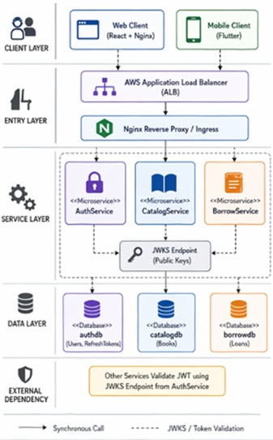
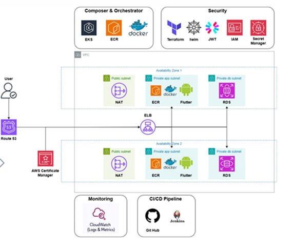
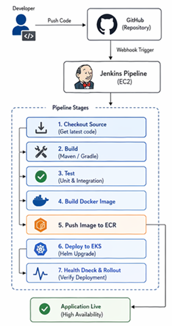
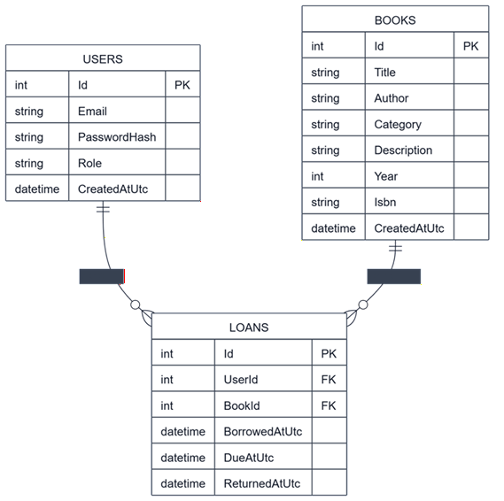
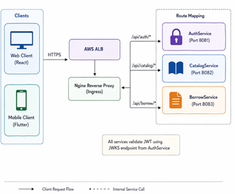
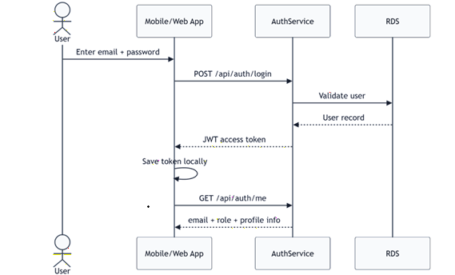
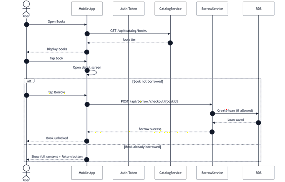
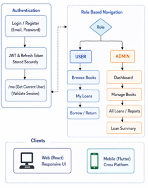

# eLib Microservices Application

This repository package documents the final eLib application that was built during the project. It summarises the architecture, deployment model, service responsibilities, API design, frontend clients, CI/CD pipeline, database design, and diagrams.

## 1. What was built

eLib is a microservices-based digital library system with:

- **AuthService** for registration, login, token refresh, logout, current-user retrieval, and JWKS publication.
- **CatalogService** for book browsing, book detail retrieval, and admin-only book management.
- **BorrowService** for checkout, return, active loans, loan history, and admin borrowing analytics.
- **Web frontend** built with Vite and served by Nginx.
- **Mobile frontend** built with Flutter and connected to the same backend APIs.
- **AWS deployment** using Docker, Amazon ECR, Amazon EKS, Helm, ALB Ingress, RDS MySQL, and Jenkins CI/CD.
- **Terraform-based infrastructure work** to support reproducibility and environment rebuilds.

---

## 2. High-level architecture

### Summary
- The **web frontend** and **Flutter mobile app** both consume the same backend services.
- The **web frontend** is exposed through the AWS ALB and proxies `/api/auth`, `/api/catalog`, and `/api/borrow` requests to the relevant services.
- **AuthService** issues JWT tokens and publishes a JWKS endpoint.
- **CatalogService** and **BorrowService** validate JWTs against the AuthService JWKS endpoint.
- Each service persists to MySQL tables within Amazon RDS.

---

## 3. AWS deployment architecture

### Deployed AWS resources
- **Amazon EKS** for Kubernetes orchestration
- **Amazon ECR** for container image storage
- **Amazon RDS MySQL** for persistent data
- **Application Load Balancer (ALB)** through Kubernetes Ingress
- **Jenkins on EC2** for CI/CD orchestration
- **Helm** for Kubernetes release management
- **Terraform** for environment and infrastructure management
- **Route 53 / ACM** planned for production HTTPS and stable domain routing

### Kubernetes services deployed
- `elib-chart-auth`
- `elib-chart-catalog`
- `elib-chart-borrow`
- `elib-chart-web`

---

## 4. CI/CD pipeline

### Pipeline stages
1. Developer pushes code to GitHub
2. GitHub webhook triggers Jenkins
3. Jenkins builds Docker images
4. Images are pushed to Amazon ECR
5. Jenkins runs Helm upgrade against EKS
6. Kubernetes performs rollout
7. Rollout verification confirms deployment health

### Notes
- This pipeline was restored and debugged during the project
- It uses image tags and Helm values to control release updates
- Kubernetes rollout status checks were included in deployment verification

---

## 5. Data model / ERD

### Core entities
- **Users**
- **RefreshTokens**
- **Books**
- **Loans**

### Relationship summary
- One user can have many refresh tokens
- One user can have many loans
- One book can appear in many loan records over time

---

## 6. API design and connection model

The public entry point is the web frontend behind the AWS ALB. The Nginx configuration in `elib-web/nginx.conf` routes API traffic to backend services:

- `/api/auth/*` → AuthService
- `/api/catalog/*` → CatalogService
- `/api/borrow/*` → BorrowService

This allows both the web frontend and mobile frontend to use a consistent API root while backend services remain separated.

### AuthService endpoints
Base route externally:
- `/api/auth/...`

Internal service routes:
- `GET /health`
- `GET /.well-known/jwks.json`
- `POST /register`
- `POST /login`
- `POST /refresh`
- `POST /logout`
- `GET /me`
- `POST /debug/decode`

### CatalogService endpoints
Base route externally:
- `/api/catalog/catalog/...`

Internal service routes:
- `GET /catalog/health`
- `GET /catalog/debug/whoami`
- `GET /catalog/books`
- `GET /catalog/books/{id}`
- `POST /catalog/books` (**AdminOnly**)
- `PUT /catalog/books/{id}` (**AdminOnly**)
- `DELETE /catalog/books/{id}` (**AdminOnly**)

### BorrowService endpoints
Base route externally:
- `/api/borrow/borrow/...`

Internal service routes:
- `GET /borrow/health`
- `GET /borrow/debug/whoami`
- `POST /borrow/checkout/{bookId}`
- `POST /borrow/return/{bookId}`
- `GET /borrow/my`
- `GET /borrow/my/active`
- `GET /borrow/admin/all`
- `GET /borrow/admin/summary`

---

## 7. Authentication flow

### Flow
1. User submits email and password
2. Frontend calls `POST /api/auth/login`
3. AuthService validates the user in `authdb`
4. AuthService returns an access token and refresh-cookie information
5. Frontend stores or uses the token
6. Frontend calls `GET /api/auth/me` to retrieve user identity and role

### Token model
- AuthService signs JWTs with RSA
- AuthService publishes the public key through JWKS
- CatalogService and BorrowService validate JWTs against that JWKS endpoint

---

## 8. Borrow and return flow

### Borrow flow
1. Client loads the book list from CatalogService
2. User selects a book and initiates checkout
3. Frontend calls `POST /api/borrow/borrow/checkout/{bookId}`
4. BorrowService validates the token and applies business rules
5. BorrowService writes the loan into the database
6. Client refreshes active loan state

### Return flow
1. Client loads active loans
2. User clicks return
3. Frontend calls `POST /api/borrow/borrow/return/{bookId}`
4. BorrowService marks the loan as returned
5. Client refreshes active and historical loan state

---

## 9. UI / client structure

### Web frontend
- Login
- Register
- Catalogue browsing
- Book details
- Borrow / return
- Admin book operations
- Admin dashboard

### Mobile frontend
- Splash screen
- Login / register
- Home shell
- Books screen
- Book detail screen
- My loans screen
- Profile screen
- Admin dashboard
- Role-aware navigation

### Important design note
The web and mobile frontends share the same backend services, but they are separate UIs. They follow the same product logic, but each client has its own interface and user flow.

---

## 10. Service responsibilities

### AuthService
Responsible for:
- user registration
- login
- refresh token issue / refresh flow
- logout
- current-user lookup
- JWT signing
- JWKS publishing

Database:
- `authdb`

### CatalogService
Responsible for:
- book listing
- book detail retrieval
- admin book creation, update, deletion

Database:
- `catalogdb`

### BorrowService
Responsible for:
- checkout
- return
- active-loan tracking
- full loan history
- admin summaries
- admin loan overview

Database:
- `borrowdb`

---

## 11. Frontend to backend connection details

### Web frontend connection
The web app is served by Nginx. It does not call service names directly in the browser. Instead, it uses ALB + Nginx routing:
- Browser → ALB → web frontend
- Nginx proxies API requests to cluster services

### Mobile frontend connection
The Flutter app calls the public ALB URL directly using the proxied API paths:
- `/api/auth/...`
- `/api/catalog/...`
- `/api/borrow/...`

This preserves one public API shape across both clients.

---

## 12. Security model

Implemented security features include:
- JWT access tokens
- RSA signing
- JWKS publication and validation
- role claims (`ADMIN`, `MEMBER`)
- admin-only policy enforcement in CatalogService
- token validation in CatalogService and BorrowService
- secret/configuration separation through environment values and secrets

### Security limitations
The project established a strong security direction, but it is not yet fully production-hardened. Before public release, the following are still recommended:
- HTTPS with ACM + Route 53 domain
- secure mobile token storage
- stricter environment separation
- deeper production hardening and testing

---

## 13. Monitoring and observability

Monitoring and observability were explored through Kubernetes health checks and CloudWatch-related instrumentation work. A key project lesson was that observability tooling can itself affect runtime stability. Auto-instrumentation introduced rollout failures, so monitoring must be validated as carefully as application code.

Future work could include:
- CloudWatch stabilisation
- Grafana dashboards
- Splunk or central log aggregation
- safer observability rollout patterns

---

## 14. Realistic project status

### Achieved
- service separation
- shared backend for web and mobile
- core library workflows
- admin functions
- CI/CD automation
- AWS deployment
- JWT-based identity flow

### Still incomplete / future work
- final production domain and HTTPS
- Play Store readiness hardening
- deeper mobile polish and optimisation
- stronger observability integration
- resilience and load testing

---

## 15. Diagram index

- `diagrams/01_system_component_uml.png`
- `diagrams/02_erd.png`
- `diagrams/03_aws_architecture.png`
- `diagrams/04_cicd_pipeline.png`
- `diagrams/05_sequence_auth.png`
- `diagrams/06_sequence_borrow_return.png`
- `diagrams/07_mobile_web_ui_flow.png`
- `diagrams/08_api_routing.png`

---

## 16. Suggested README usage
This README can be used as:
- the top-level project summary
- dissertation appendix support material
- handover documentation
- technical project overview for demonstration or viva

